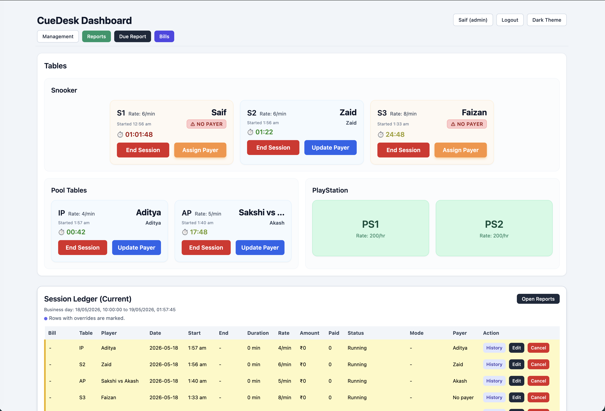
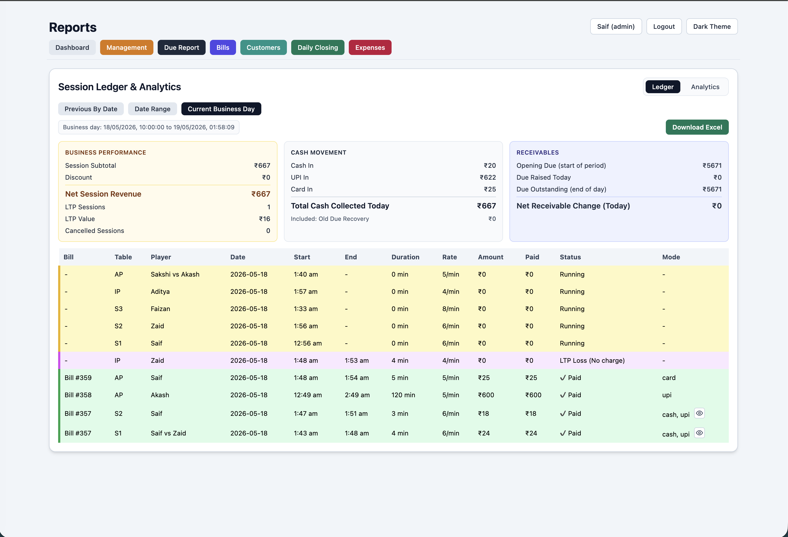
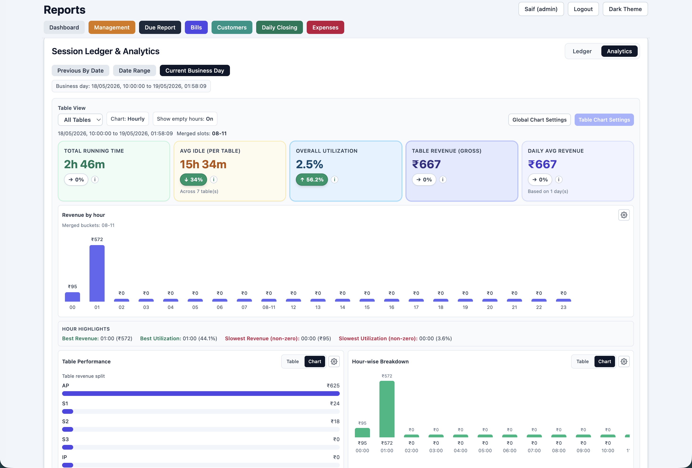

# CueDesk

Production-grade, LAN-first Point of Sale and operations system for a snooker club.

Designed and shipped in 2 days using spec-driven, AI-assisted development. The repository includes the PRD, architecture notes, TDD plan, state machine, and API contracts used to direct the build.

## Screenshots

### Live Dashboard



### Session Ledger



### Analytics



## What It Does

CueDesk replaces paper/manual table tracking with a local POS workflow for real venue operations:

- start, manage, and end snooker table sessions
- assign single or split payers
- generate bills from completed sessions
- collect cash, UPI, card, and due payments
- prevent overpayment and billing edge cases at the backend
- track due settlement and daily closing
- view business-day-aware ledger, analytics, expenses, and customer insights
- run on LAN without a cloud dependency
- operate from a web UI or Android LAN app

The system is built for staff usage: fast actions, large mobile-friendly controls, backend-derived status, and minimal ambiguity during billing.

## Why This Project Matters

CueDesk was built as a practical demonstration of agentic coding and AI-assisted software delivery.

The goal was not to "prompt an app into existence." The goal was to compress the implementation cycle while preserving real engineering discipline:

- wrote the product requirements document before implementation
- designed the session lifecycle as an explicit state machine
- defined backend API contracts and Prisma data models
- kept business rules in services instead of the UI
- used a TDD plan to protect billing, payment, payer, and override logic
- packaged the system for local production use and Android access

AI accelerated the code generation. Human engineering judgment still drove the product decisions, architecture, validation rules, and production tradeoffs.

## Core Architecture

CueDesk uses a backend-first architecture where the database and service layer are the source of truth.

```text
UI -> API route -> service/business rule -> Prisma/SQLite -> backend-derived response
```

Important rules:

- UI displays state; it does not decide billing truth.
- Billing truth is based on `billId != null`, not a status label.
- Effective session status is derived with `overrideStatus ?? status`.
- Payments are validated against discounted remaining totals.
- Ledger windows follow a configurable business-day reset time.
- Role checks are enforced by backend APIs.

See:

- [PRD](./prd.md)
- [Design Index](./design.md)
- [Architecture](./docs/architecture.md)
- [State Machine](./docs/state-machine.md)
- [API Reference](./docs/api-reference.md)
- [TDD Plan](./tdd-plan.md)

## Tech Stack

- Next.js App Router
- React
- TypeScript
- Prisma ORM
- SQLite
- Tailwind CSS
- Vitest
- Capacitor Android

## Feature Highlights

### Table and Session Operations

- table dashboard with derived states:
  - `Free`
  - `Running-NoPayer`
  - `Running-Single`
  - `Running-Split`
  - `Completed (Unbilled)`
  - `Billed`
- session start/end lifecycle
- live timers for running sessions
- normal, cancelled, and LTP-loss outcomes
- override support for audit-safe corrections
- special hourly-bucket pricing for PS tables

### Billing and Payments

- bill creation from completed sessions
- bill-level fixed or percentage discounts
- split and partial payment support
- `cash`, `upi`, `card`, and `due` payment modes
- backend no-overpay validation
- due tracking and settlement support
- customer-linked dues by name/phone

### Ledger, Reporting, and Analytics

- configurable business-day reset time, defaulting to 10 AM
- ledger views by current day, selected day, or range
- revenue, collection, due, unpaid, and balance summaries
- daily report snapshots
- table-wise revenue and runtime analytics
- idle-time and best/slow-hour reporting
- single-table and all-table chart modes
- report tab caching and background prefetching

### Customer and Operations Tools

- customer insights from payer, bill, session, and payment data
- top-customer, high-value, at-risk, and action-required segments
- daily closing with opening balance, manual sales, dues, expenses, and live preview
- expense category management and expense entry log
- table, section, user, and settings management

### Auth and Access Control

- PIN-based login
- mobile numeric keypad
- local persisted auth with inactivity timeout
- `admin` and `operator` roles
- admin-only management route
- backend authorization checks across APIs

### Android LAN App

The Android app is built with Capacitor and points at the local CueDesk server.

- first-launch server setup screen
- configurable host and port
- reachability validation before opening the WebView
- server settings accessible from Android headers
- cleartext HTTP enabled for local LAN usage

## Project Structure

```text
src/app/page.tsx                         Main POS dashboard and billing UI
src/app/api/**                           API routes for sessions, bills, reports, auth, management
src/app/reports/**                       Reports, customer insights, daily closing, expenses
src/components/auth-provider.tsx         Auth state, persistence, inactivity timeout, auth headers
src/lib/services/**                      Domain services for sessions, billing, payments, customers
src/lib/session-status.ts                Centralized status derivation
src/lib/state-machine.ts                 Lifecycle ordering and transition guards
src/lib/tables-service.ts                Table CRUD and table-state derivation
src/lib/authz.ts                         Backend role authorization helpers
src/tests/**                             Unit tests for core business rules and edge cases
prisma/schema.prisma                     Data model
docs/**                                  Architecture, state machine, API docs, setup docs
scripts/**                               Backfills, benchmarks, packaging utilities
```

## Setup

Install dependencies:

```bash
npm install
```

Create `.env`:

```bash
DATABASE_URL="file:./prisma/dev.db"
```

Sync the database and generate Prisma client:

```bash
npx prisma db push
npx prisma generate
```

Run the development server:

```bash
npm run dev
```

Open:

```text
http://localhost:3000
```

## LAN Usage

Start the server and open it from other devices on the same Wi-Fi:

```bash
npm run build
npm run start
```

Then open:

```text
http://<your-lan-ip>:3000
```

For Android physical devices, use the real LAN IP of the server machine.

## Android Build

Sync and open the Android project:

```bash
npx cap sync android
npx cap open android
```

Build debug APK:

```bash
npm run android:build:debug
```

Notes:

- phone and server must be on the same Wi-Fi
- production server runs on `0.0.0.0`
- emulator host mapping can use `10.0.2.2`
- physical devices should use the server machine's LAN IP

## Scripts

```bash
npm run dev                         # start development server
npm run build                       # production build
npm run start                       # run production server on 0.0.0.0
npm test                            # run unit tests
npm run test:watch                  # run tests in watch mode
npm run package:server              # create deployable server archive
npm run seed:reset-demo             # reset and seed demo data
npm run backfill:bills              # backfill missing billId values
npm run backfill:business-day-keys  # backfill legacy business day keys
npm run backfill:daily-closing      # populate historical closing snapshots
npm run backfill:expenses           # seed historical expense categories/entries
```

Benchmark utilities:

```bash
scripts/benchmark-apis.sh
scripts/benchmark-apis-concurrent.sh
```

## Key API Endpoints

- `POST /api/auth/login`
- `GET /api/dashboard-live`
- `POST /api/session/start`
- `POST /api/session/end`
- `POST /api/session/assign-payer`
- `POST /api/session/override`
- `POST /api/bill/create`
- `POST /api/payment/add`
- `GET /api/ledger`
- `GET /api/analytics`
- `GET /api/customer-insights`
- `GET /api/reports/daily-closing`
- `POST /api/reports/daily-closing`
- `GET /api/expenses/categories`
- `GET /api/expenses/entries`

Route-level request and response details are documented in [API Reference](./docs/api-reference.md).

## Testing

Run:

```bash
npm test
```

Tests cover:

- session lifecycle and override behavior
- payer validation
- billing and discount calculations
- payment edge cases, including overpay prevention
- status derivation helpers
- user management and auth-related rules

## Status and Billing Truth Rules

```ts
effectiveStatus = overrideStatus ?? status;
isBilled = billId != null;
```

Ledger status is derived by the backend from effective status, bill linkage, and paid amount. The UI should not compute billing truth.

## LinkedIn Summary

CueDesk is a production POS system for a real snooker club, shipped in 2 days through spec-driven, AI-assisted development. I wrote the PRD, designed the state machine, defined the API and data model, directed the implementation, reviewed edge cases, and packaged the system for LAN and Android use.

This project demonstrates agentic coding in practice: using AI to compress implementation time while keeping product judgment, architecture, testing strategy, and production validation human-led.
