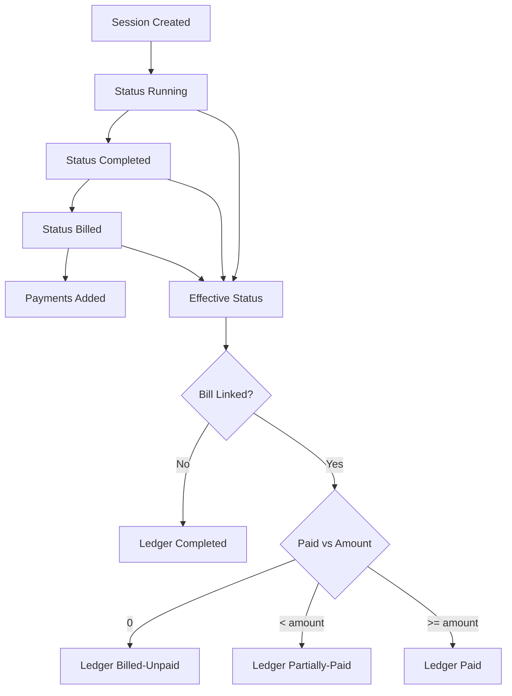

# CueDesk State Machine

## 1. Core Concepts
CueDesk tracks three related but distinct notions:
- **stored session status**: DB `status` (`running`, `completed`, `billed`)
- **effective session status**: `overrideStatus ?? status`
- **derived ledger/table states**: computed views for UI

## 2. Effective Status
Single source formula:

```ts
effectiveStatus = overrideStatus ?? status
```

Valid effective statuses:
- `running`
- `completed`
- `billed`

## 3. Billing Truth
Billing is not inferred from status text.

```ts
isBilled = billId != null
```

This is the canonical check used for ledger/table derivation.

## 4. Ledger Status Derivation
Implemented centrally in `src/lib/session-status.ts`.

```ts
if (effectiveStatus === "running") return "Running";
if (!isBilled) return "Completed";
if (paidAmount === 0) return "Billed-Unpaid";
if (paidAmount < amount) return "Partially-Paid";
return "Paid";
```

## 5. Table Status Derivation
Also centralized in `src/lib/session-status.ts`.

```ts
if (effectiveStatus === "running") {
  if (payerMode === "none") return "Running-NoPayer";
  if (payerMode === "single") return "Running-Single";
  return "Running-Split";
}
if (!isBilled) return "Completed (Unbilled)";
return "Billed";
```

## 6. Lifecycle Ordering
Defined in `src/lib/state-machine.ts`:

```ts
Free: 0
Running: 1
Completed: 2
Billed: 3
Paid: 4
```

Transition predicate:

```ts
canTransition(current, next) => STATE_ORDER[next] <= STATE_ORDER[current]
```

This supports strict backward-only override behavior.

## 7. Guard Rules
Important guardrails enforced in services:
- Prevent payment when bill does not exist.
- Prevent overpayment beyond remaining discounted total.
- Prevent invalid override ranges (`end <= start`).
- Prevent invalid payer override payloads.
- Prevent forbidden lifecycle jumps via state-machine checks.
- When ending a session that was force-overridden to running:
  - find by `status=running OR overrideStatus=running`
  - set `status=completed`
  - clear `overrideStatus` to avoid bounce-back.

## 8. Practical Transition Examples
- `running -> completed`: valid via end session.
- `completed -> billed`: valid via bill creation or override with guards.
- `billed -> completed`: only allowed when bill constraints pass (e.g., no payments depending on path).
- `completed -> running`: allowed as backward override.
- `paid -> billed`: guarded and requires explicit admin override behavior where applicable.

## 9. Mermaid Diagram
Use this compatible diagram block:



